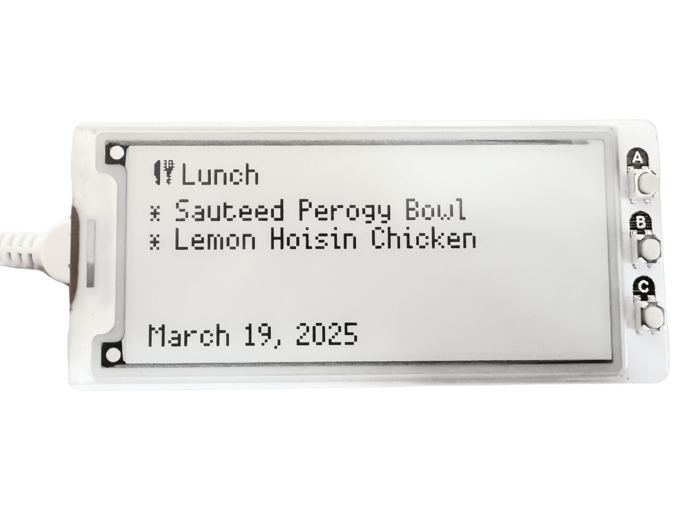

# Wheelock Dining Hall Menu Display
Display today's menu at Wheelock Dining Hall on an e-ink display using the Raspberry Pi Pico W and Pimoroni's Inky Pack.

## Getting Started
1. Attach Pimoroni's Inky Pack to a Raspberry Pi Pico W
2. Flash Pimoroni's firmware (version 1.23.0 - Bugfix 1) to the Pico.
3. Upload the repository to the Pico.
4. Rename `env_example.py` to `env.py` and fill in your information.

The API endpoint is an HTTP URL that accepts GET requests and returns data in the following format:
```json
{
    "date": "March 19, 2025",
    "menu": {
        "lunch": [
            "Sauteed Perogy Bowl",
            "Lemon Hoisin Chicken"
        ],
        "dinner": [
            "Beef Vegetable Stew",
            "Pasta with Chicken and Pomodoro Sauce"
        ]
    }
}
```
- The API Key will be passed to the `X-API-Key` header. If your endpoint does not require authorization, set the API Key to a blank string.

# Demo
